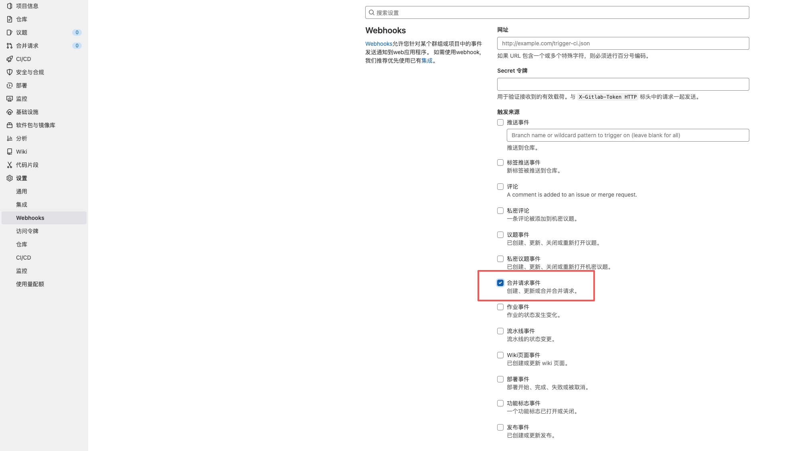
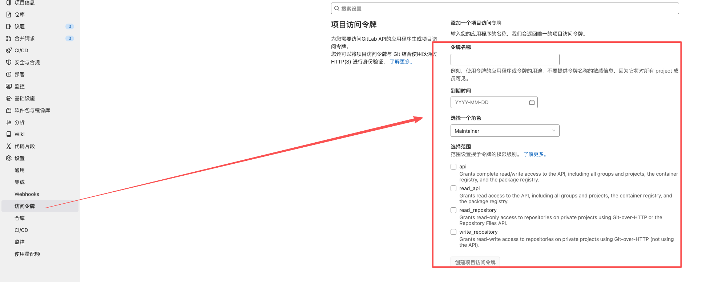
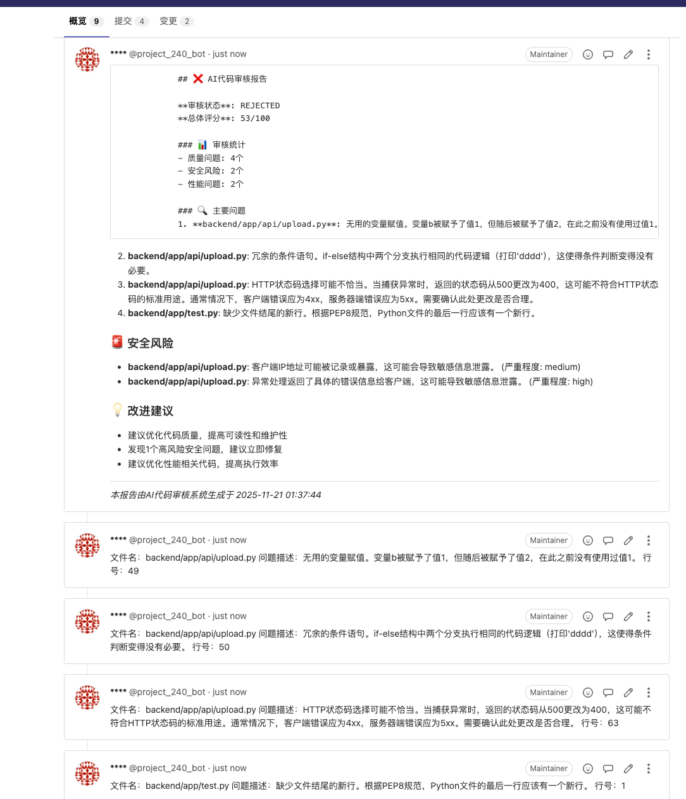

# ai_code_review
随着软件项目日趋复杂，传统人工代码审查耗时费力且易受主观影响。基于大语言模型的AI审查工具，凭借其强大的代码分析与自然语言理解能力，为实现自动化、智能化的代码审查提供了新可能。

# gitlab 代码审查工具
1. 项目配置
   - 配置gitlab webhook，触发审查事件
     - 配置页面：
     - 
   - 配置codeup项目token，用于访问codeup api
     - 生成界面
     - 
2. 代码审查
   - 收到gitlab webhook事件后，触发审查流程
   - 从codeup获取变更请求diff
   - 利用大语言模型分析diff，生成审查报告
   - 将审查报告回写到gitlab变更请求中
   - 效果预览
   - 
